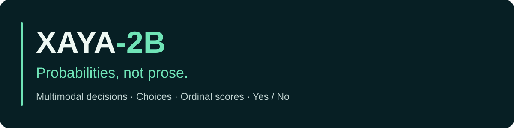

A 2B multimodal structured decision model for **bounded choices, ordinal scores, and yes/no probabilities**.

Supply state/context, a question, and a finite candidate set, optionally with an image. XAYA returns a probability distribution over the candidates through **CHOICE**, **SCORE**, and **NOUL**. Maximum options: **256**.

**Release status:** the v1 weights are frozen. Canonical single-pass runtime reproduction is pending. This repository provides project documentation, historical benchmark evidence, preserved reference code, and working diagnostic tools. It does not yet provide a validated canonical SDK, server, or FINAL release.

## Where is the model?

**This GitHub repository currently has no downloadable model weights or FINAL release.** The frozen checkpoint exists in the original `xaya_2b_final_release.zip` archive. Its required components are:

- `adapter/adapter_model.safetensors` — the trained LoRA adapter.
- `decision_head.pt` — the original trained decision head.
- `processor/`, `release_config.json`, and `model_lock.json` — processor files, pinned configuration, and identity.
- The separate pinned `Qwen/Qwen3.5-2B` base, loaded at the revision listed below.

The supplied Kaggle notebook used the checkpoint at `/kaggle/input/datasets/kartxlegendyt/xaya-2b-final`. That dataset name and the archive's filename do not establish a validated FINAL runtime. A public weight download and a usable canonical runtime remain unfinished release work.

The attached canonicalization run completed one profile at **142/231 = 61.47%**, Brier **0.5946317165**, with Original **50/72**, Easy **48/48**, and Hard **44/111**. The other three profiles failed. It did **not** pass the historical fingerprint, so this repository must not claim that `XAYA-2B-v1.0.0-FINAL.zip` was produced.

See [the current model and release status](docs/RELEASE_STATUS.md).

## The decision interface

```text
state/context + question + candidate options [+ image]
                         ↓
                      XAYA-2B
                         ↓
               candidate probabilities
```

Example output shape (illustrative probabilities, not an inference result):

```json
{
  "candidates": ["approve", "reject", "manual review"],
  "probabilities": [0.18, 0.11, 0.71],
  "selected_index": 2
}
```

Applications include agent/tool routing, RAG routing, support triage, moderation, model routing, multimodal classification, and rubric scoring. Validate accuracy and calibration for each application before using probability thresholds.

## Historical results

| Evaluation | Accuracy | Tasks | Qualification |
|---|---:|---:|---|
| JevBench public development | **64.07%** | 231 | Historical frozen single-request target; Brier 0.5611851962 |
| Local text test | 79.8768% | 13,800 | Local held-out split |
| Financial sentiment | 62.37% | 11,000 | Fully held-out source |
| AI2D | 68.33% | 3,088 | Full external evaluation |
| A-OKVQA MC | 74.50% | 1,145 | Full external evaluation |
| RM-Bench | 58.69% | 11,943 | Pairwise adaptation; not official scalar protocol |
| TruthfulQA | 68.10% | 790 | Binary adaptation |

JevBench tiers: **Original 50/72**, **Easy 48/48**, **Hard 50/111**. This is public development evidence, **not an official sealed Benchmark Heaven rank**. Results are historical project evidence, not newly rerun measurements. Internal image dev/test at 100% is internal/in-distribution evidence only.

The documented public-231 comparisons are Open-Jev-2B 64.94%, Open-Jev-9B 77.49%, and Open-Jev-27B v1.1 85.28%. Hard-111: Open-Jev-2B 41.44%. These comparisons do not establish statistical significance or a current leaderboard.

## Run the diagnostic tools

The diagnostic tools require **Python 3.11+ and the standard library only**. They do not load a model, download weights, or train.

```bash
python -m unittest discover -s tests -v
python tools/check_integrity.py
python tools/assess_diagnostics.py /path/to/xaya_canonical_diagnostics.zip
```

The assessor accepts a diagnostics ZIP, JSON/JSONL file, or directory. It recomputes scores from probabilities, aligns known task IDs, reports invalid or missing evidence, and writes per-task comparisons to `diagnostic-assessment/`. It never exports FINAL. Its aggregate check uses supplied gold indices; option semantics must still be verified against the historical evaluator.

See [reproduction protocol](docs/REPRODUCTION.md), [model card](docs/MODEL_CARD.md), and [release roadmap](docs/ROADMAP.md).

## Frozen identity

| Field | Value |
|---|---|
| Base | `Qwen/Qwen3.5-2B` |
| Base revision | `15852e8c16360a2fea060d615a32b45270f8a8fc` |
| Adapter layout | `qwen35-language-projections-v2` |
| LoRA | r=32, alpha=64; RSLoRA enabled in export |
| Training | Native NF4/PEFT, 2 × Tesla T4, seed 13 |

Recorded original model lock:

```text
d1fc1e1d3ddd1795dcf207263424b320bb4692ccec7b092c9977e6e27c6a591a
```

Dataset manifest SHA256:

```text
c6a0802778083e6664f54efae2fe927c3dae104c3b040ef5956d33cbb8a7ae57
```

The original aggregate lock construction code is not available here. Component hashes match the historical benchmark log, and the dataset-manifest hash was independently verified. Model binaries are kept outside Git. Safetensors conversion preserves all head tensors exactly and has a separate serialization hash; end-to-end GPU parity remains pending.

## License and release

The training-data license audit is pending, so no repository-wide model distribution license has been selected. See [license audit status](docs/LICENSE_AUDIT.md). Pinned JevBench reference files retain their [upstream license](benchmarks/jevbench/LICENSE).

XAYA-2B v1 will remain frozen. Further training requires an explicit v2 decision.
